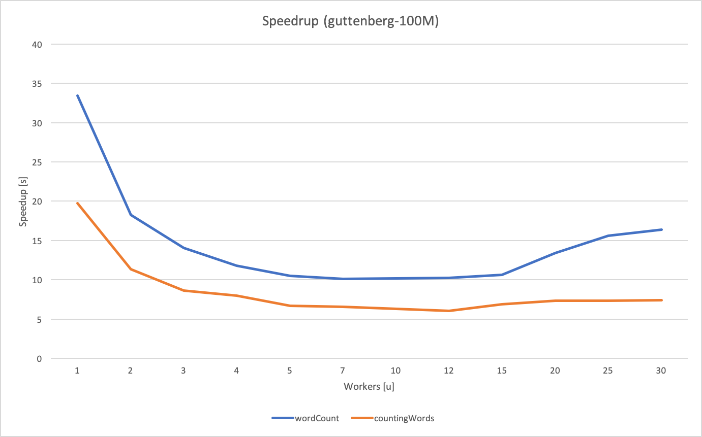

# Task 1: Communication models and Middleware

## Getting Started
<p align="justify">
zfgf fg sfdg sdfg dfsg sdfgsdfg sdfgsdf gsdfgsdfgs fgsdfgsfdgsfgsdh ghsghsdfgsdfg sdfgsdfgsdfgsfdg sdfgsfgsfdg sdfgsfgfgsg rgsdfgfdjfg dfgsgfsdf gsdfgsd fgsfd gs dfg sfdgsdf gsdfgs dfgsdfg sf gsf gsfdgs gfsfgsfgs fgsfgsf gsfg sfgsdfgsdfg sfgfsgfs gsfgfsg fsgsgsfdg sfgdsf g
<p>
These instructions will get you a copy of the project up and running on your local machine for development and testing purposes.

### Prerequisites

Is requiered a configuration file (in .yaml format) located in the root direcory of the project, and named ibm_cloud_config in order to have access to those services.
ibm_cloud_config follows the following format:

```
ibm_cf:
    endpoint    : CF_API_ENDPOINT
    namespace   : CF_HOST
    api_key     : CF_API_KEY
    bucket      : Bucket

ibm_cos:
    endpoint   : COS_API_ENDPOINT
    access_key : ACCESS_KEY
    secret_key : SECRET_KEY

rabbitmq:
    url         : URL
```

yaml is necessary to read the configuration file, and it can be intalled like this:

```
sudo pip install pyyaml
```


### Installing

To run the code is necessary to have some functions on the cloud, they can be created with the  createFunctions.py code

```
python3 createFunctions.py
```
## Running the program
Orchestrator calls both types of functions and when they finish it downloads the results to
the root of the project.\
The program can be executed with the following command:

```
python3 orchestrator textFile numberWorkers
```
* **textFile** as the name of the file the program is going to analyse
* **numberWorkers** as the number of paralel functions the program is going to call<br><br>
for example the following command would analyse the pg2000.txt file with 10 workers
```
python3 orchestrator.py pg2000.txt 10
```

## Speedup

A code has been created in order to ease the execution of the speedup. It can be found in the folder called speedup and it is called like this:
```
python3 speedup.py textFile
```
this program executes the functions some times with different number of workers saying the time they last.\
A result of this code:


## Our project

### Important points
* Numbers and non UTF-8 characters are deleted 
* As unwanted characters are deleted, words like www.github.com are transformed to wwwgithubcom
* The workers do not cut any word
* 2 different queues of rabbitmq are used, one for each worker type

### 

## Built With

* [IBM cloud](https://www.ibm.com/uk-en/cloud) - cloud functions
* [rabbitmq](https://www.rabbitmq.com) - queue management

## Authors

* **Guillem Frisach Pedrola** - (guillem.frisach@estudiants.urv.cat)
* **Magí Tell Bonet** - (magi.tell@estudiants.urv.cat)

## License

This project is licensed under the MIT License - see the [LICENSE.md](LICENSE.md) file for details
