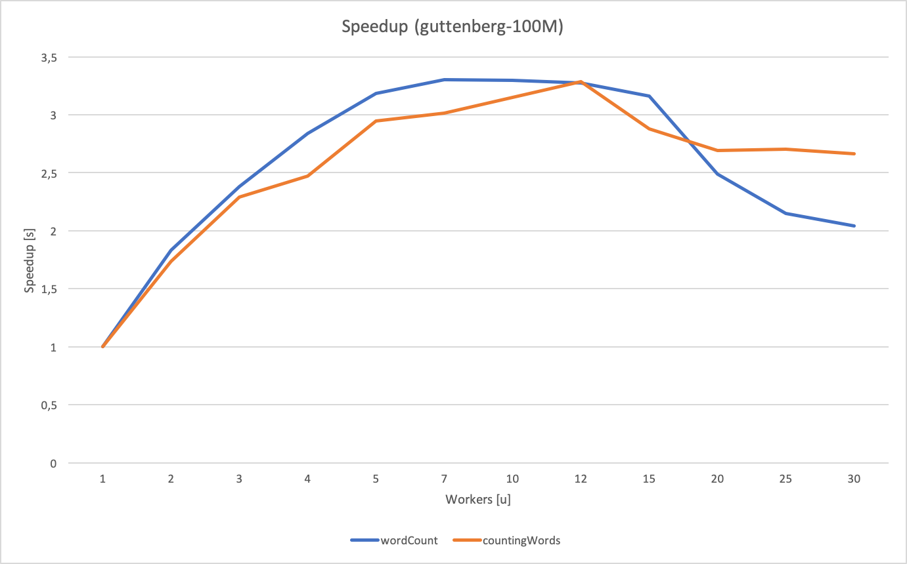

# Task 1: Communication models and Middleware
[](https://www.python.org/downloads/release/python-370/)

## Getting Started
These instructions will get you a copy of the project up and running on your local machine for development and testing purposes.

This project is an evaluative task for "Sistemes Distribuits" (Distibuted systems), a subject from Universitat Rovira i Virgili's Grau en Enginyeria Informàtica.

### Prerequisites

Is requiered a configuration file (in .yaml format) located in the root direcory of the project, and named ibm_cloud_config in order to have access to those services.
ibm_cloud_config follows the following format:

```
ibm_cf:
    endpoint    : CF_API_ENDPOINT
    namespace   : CF_HOST
    api_key     : CF_API_KEY

ibm_cos:
    endpoint   : COS_API_ENDPOINT
    access_key : ACCESS_KEY
    secret_key : SECRET_KEY
    bucket     : Bucket

rabbitmq:
    url         : URL
```

yaml is necessary to read the configuration file, and it can be intalled like this:

```
sudo pip install pyyaml
```


### Installing

To run the code is necessary to have some functions on the cloud, they can be created with the  createFunctions.py code

```
python3 createFunctions.py
```
## Running the program

The program can be executed with the following command:

```
python3 orchestrator textFile numberWorkers
```
* **textFile** as the name of the file the program is going to analyse
* **numberWorkers** as the number of parallel functions the program is going to call<br><br>
<p align="left">
For example the following command would analyse the pg2000.txt file with 10 workers:
<p>
    
```
python3 orchestrator.py pg2000.txt 10
```

## Speedup

A code has been created in order to ease the execution of different number of workers . It can be found in the folder called speedup and it is called like this:
```
python3 workers.py textFile
```
this program executes the functions some times with different number of workers saying the time they last.\
A result of this code:


## Our project

### Important points
* Numbers and non UTF-8 characters are deleted. 
* Orchestrator calls both types of functions and when they finish it downloads the results to
the root of the project.
* As unwanted characters are deleted, such as commas, accents, exclamation pints, and so on. For example words like ```www.github.com``` are transformed to ```wwwgithubcom```, ```tête``` should appear as ```tte``` and ```tömato!``` as ```tmato```.
* The workers do not cut any word.
* 2 different queues of rabbitmq are used, one for each worker type.

## Functions

Both two functions used in the projects (wordCounts & countingWords) are implemented as "mapreducers". A mapreduce is just the merge between:
* map(): A mapping between keys and values.
* reduce(): A way to keep decreasing the size of a stream to a single resultant value

### wordCount

The wordCount counts the number of occurrences of each word in a text file. For instance, given the following text: "foo bar bar foo", the output of wordCount is: 
```
{bar:2; foo:2}
```

### countingWords

CountingWords, counts the total number of words in a text file. For example, given the following text: "I love Distributed Systems", the output of CountingWords is:
```
4 words
```

### How do they work?

* The ```orchestrator``` is the one in charge of invoking each function as many times as needed.
* Each time a function is invoked, a message is generated. The ```reduce``` collects all of those messages.
* Once the ```reduce``` has finished, it uploads the results to the IBMCloud COS.
* The ```orchestrator``` downloads the result files.

## Built With

* [IBM cloud](https://www.ibm.com/uk-en/cloud) - cloud functions
* [rabbitmq](https://www.rabbitmq.com) - queue management

## Authors

* **Guillem Frisach Pedrola** - (guillem.frisach@estudiants.urv.cat)
* **Magí Tell Bonet** - (magi.tell@estudiants.urv.cat)

## License

This project is licensed under the MIT License - see the [LICENSE.md](LICENSE.md) file for details
